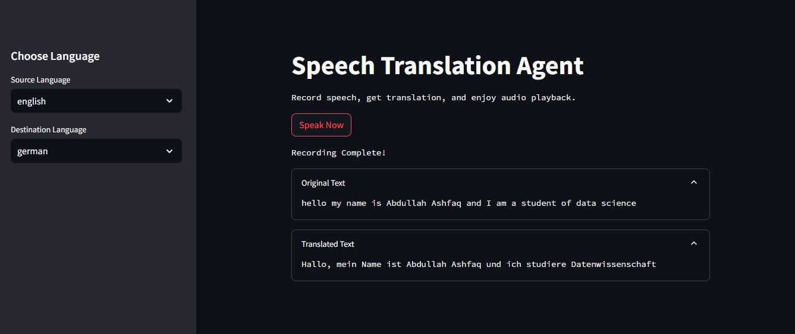

# Speech Translation Agent

The Speech Translation Agent is a real-time translation application featuring a Streamlit interface. Users can select languages, speak into the app, view translations instantly, and hear the agent vocalize the translated text.

## Features

- Users can select source and target languages for translation.
- The application records spoken input and translates it into the selected target language.
- The agent vocalizes the translated text, providing audio feedback to enhance user interaction.
- Both the original recorded text and the translated text are displayed on the interface for user convenience.

## Streamlit Interface



## Installation and Setup

Follow these steps to set up and run the application:

1. **Clone the Repository**

    ```bash
    git clone git@github.com:abdullahashfaq-ds/Speech-Translation-Agent.git
    cd Speech-Translation-Agent
    ```

2. **Create and Activate a Virtual Environment**

    For Linux/Mac:

    ```bash
    python -m venv venv
    source venv/bin/activate
    ```

    For Windows:

    ```bash
    python -m venv venv
    venv\Scripts\activate
    ```

3. **Install Dependencies**

    ```bash
    pip install -r requirements.txt
    ```

4. **Run the Streamlit Application**

    ```bash
    streamlit run app.py
    ```

## License

This project is licensed under the [MIT License](LICENSE). See the LICENSE file for more details.
